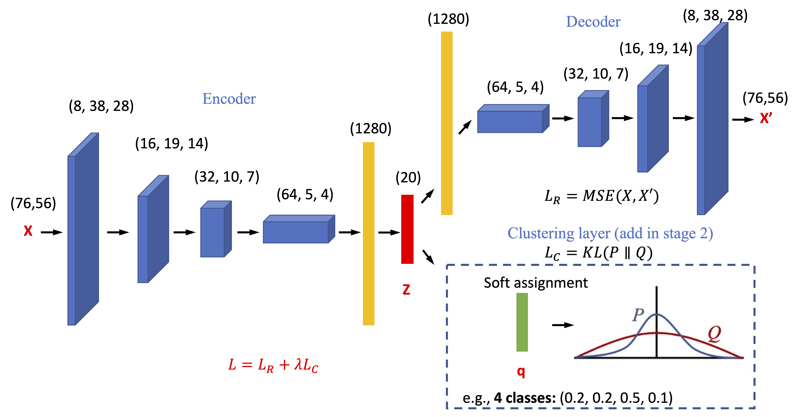

# Unsupervised Characterization of Rain-Induced Seismic Noise in Urban Fiber-Optic Networks Using Deep Embedded Clustering

## Introduction
This repo contains the codes to generate figures in the paper: Shen, J., and Zhu, T. (2025). Unsupervised Characterization of Rain-Induced Seismic Noise in Urban Fiber-Optic Networks Using Deep Embedded Clustering, submitted to Water Resources Research.

Fig. 1 Deep learning model architecture

## Files
* Three jupyter notebooks: workflow of training a DEC model to identify rain-induced signals in continous DAS recordings.
    * 1_Deep_clustering_training.ipynb: train the deep learning network.
    * 2_Deep_clustering_test.ipynb: test the deep learning model.
    * 3_Implications_for_discharge_process.ipynb: use predictions from the well-trained model to estimate discharge process.
* model_DEC.py: Modules of the architecture of DEC model.
* DEC_utils.py: Other functions for data processing.
* config.py: parameter file
* **data**: saved weights of final model and predictions from all continous data. *Raw/processed DAS data are not included due to their large file size.* 
